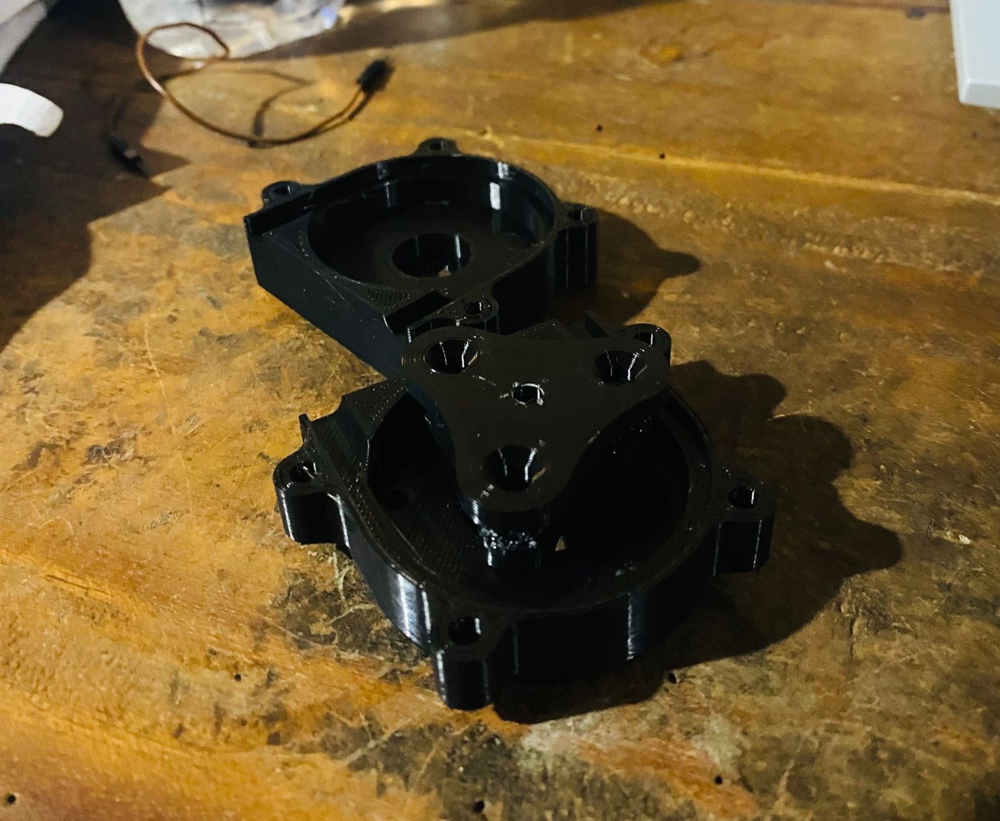

# Automated Saline Pump System

This repository contains the implementation of an Automated Saline Pump System named FlowGuard. The project was completed as part of the Biomedical Device Designing module by Group D at the Department of Electronic & Telecommunication Engineering, University of Moratuwa, Sri Lanka.

## 👥 Team Members

- Jayamadu Gammune
- Isiri WIthanawasama
- Sandun Herath

Special thanks to Lohan, Charels, and Kaveendra for their assistance in transferring and verifying the data.

## 🎯 Objective

The objective of this project is to design, implement, and verify an automated saline pump system that can monitor saline flow rate in patients remotely for enhanced patient management.

## 🔑 Key Features

- 📡 Remote monitoring of saline flow rate using IoT
- 💻 Automated stopping of reverse flow
- 🔔 Notification system for low saline levels
- 🛠️ Integration with hospital control room notifications
- 📊 Design and implementation of PCB and enclosure

## 🛠️ Hardware and Software Requirements

**Hardware:**
- Temperature sensor
- Peristaltic pump
  
- Non-contact water level sensor
- ESP8266 Wi-Fi module
- Wireless power supply module

**Software:**
- Web server software for control and monitoring
- Serial communication protocol for data exchange
- Alarm system integration software
- Data logging and analysis tools

## 🚀 How to Use

1. **Clone the Repository:**
```bash
git clone https://github.com/JayxTG/Automated_Saline_Pump.git
```
2. **Software Setup:**
- Deploy the web server software in the software/server directory.
- Configure the patient registration system using the provided software.

## 📄 License
This project is open-source and available under the MIT License.
